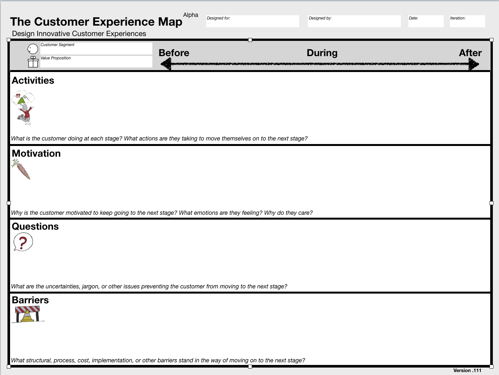

# The-Customer-Experience-Map

### Overview
The Customer Experience Map helps organizations leveraging the Strategyzer Business Model Canvas and Value Proposition Design streamline and optimize customer experiences.

### Background
The Customer Experience Map is a class project from the [2018 Strategyzer Bootcamp](https://blog.strategyzer.com/posts/2017/12/20/2018-strategyzer-bootcamp-become-a-business-model-innovation-coach) for Business Model Canvas Innovation coaches.  One of the incredible class exercises from this incredible workshop is to take a crack at building a tool.  The Custoemr Experience Map is a tool designed by:

*  Eman Almousawi
*  Jesse Desjardins
*  Suzanne Nuthall
*  Liam Randall

We would love your **feedback** on this tool- please see **Feedback** below or simply open an issue on github at the right!

Snapshot:

### Instructions for Use:

1. **Actions:**
* What is the customer doing at each stage? What actions are they taking to move themselves on to the next stage? (Don't list what your company or partners such as retailers are doing here. That will come later when we look at touchpoints)

2. **Motivations:**
* Why is the customer motivated to keep going to the next stage? What emotions are they feeling? Why do they care?

3. **Questions:**
* What are the uncertainties, jargon, or other issues preventing the customer from moving to the next stage?

4. **Barriers:**
* What structural, process, cost, implementation, or other barriers stand in the way of moving on to the next stage?

### Background

### Design Constraints

1. Purpose & Scope
* The tool addresses one clear Job-To-Be-Done.  It's a scalpel, not a swiss army knife.

2. Conceptually Sound
* Building blocks are **mutually exclusive** (an element only fits into one building block) and **collectively exhaustive**.  They cover the most important concepts in that problem space.

3. Existing Knowledge & Theories

4. Usability & UX
5. Vizualization
6. Collaboration
7. Adaptability & Versatility
8. Integration

### Feedback

As a class project we would love to get some short term feedback on useability and 
